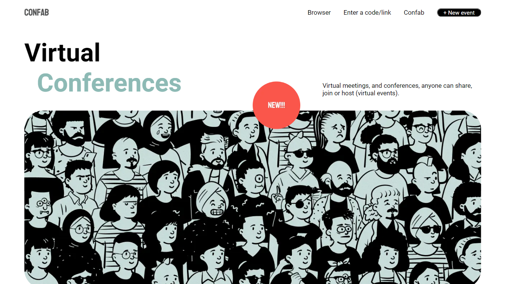

<p align="center">
	
</p>

<h1 align="center">Confab</h1>

## Status

<h4 align="center"> 
	Confab - In Progress 🚧
</h4>

## Description

Confab is an application about people and conferences. Users are invited to join virtual events and create your own too.

## Content

-   [Description](#description)
-   [Status](#status)
-   [Content](#content)
-   [How to use it?](#how-to-use-it)
-   [Stack and Technoloy](#stack-and-technology)
-   [Application Photos](#application-photos)

## How to use it?

Confab is a front-end project.

1. Clone the repository

```
git clone https://github.com/ericiannj/stocks-manager.git
```

2. Install the front-end dependencies;

```
yarn
```

3. Run the code.

```
yarn start
```

## Stack and Technology

-   Typescript
-   Next JS
-   Styled Components

## Application Photos


